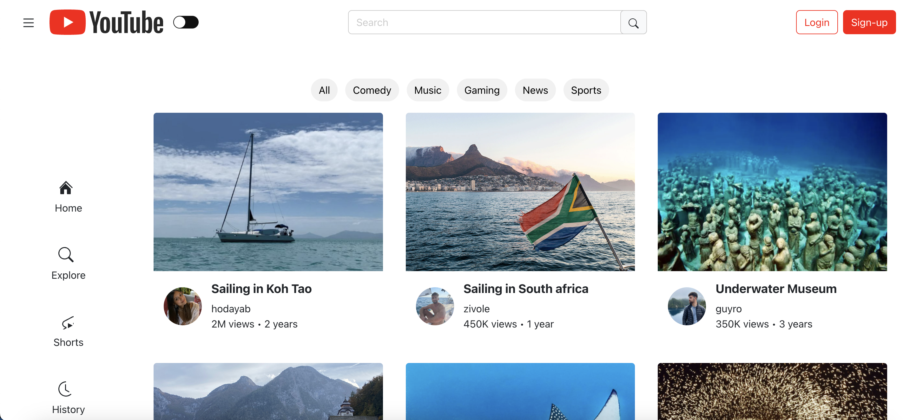
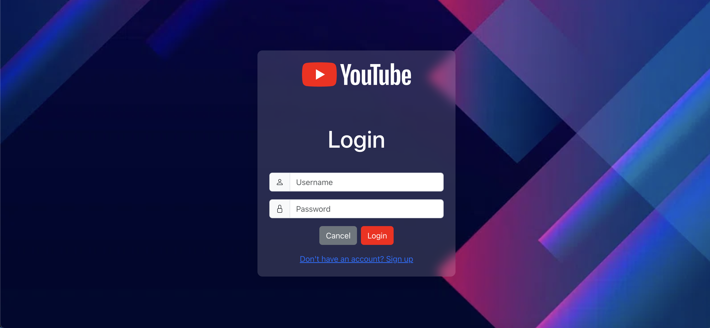
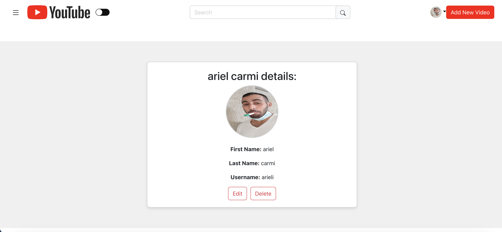
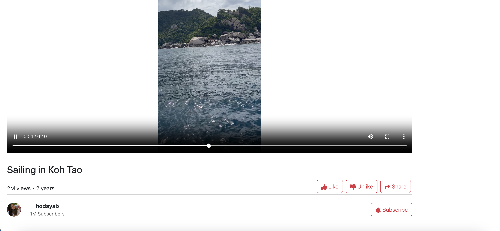
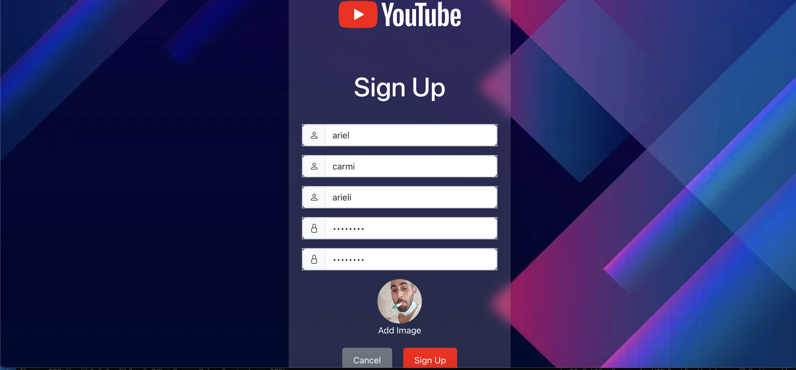
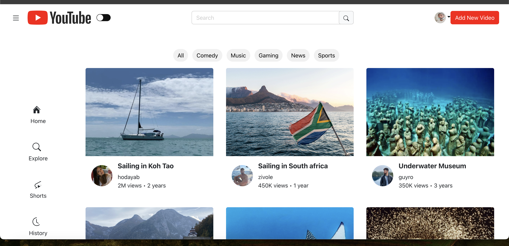

# Overview

# App Overview
Our app is a versatile video-sharing platform designed for a smooth and intuitive user experience. From the Home Page, users can easily explore a range of videos, use the search bar to find specific content, and personalize their interface with options like signing in, signing up, or switching to dark mode. The aim is to create a user-friendly and engaging interface from the start.

Users can navigate to the Watch Video Page, where they enjoy smooth video playback with controls like pause, skip, and rewind. They can actively participate by leaving comments, liking or disliking videos, and viewing the total number of views. Engagement is a priority here, allowing users to add and delete comments, building a community around each video.

The Sign-Up and Sign-In Pages ensure a hassle-free experience for creating accounts and logging in. With features like username availability checks and password strength validation, the process is secure and user-friendly. After signing in, the Profile Page serves as a personal space where users can update their username, manage their uploaded videos, and sign out when needed. Any changes made are immediately reflected throughout the platform, from the video listings to the Watch Video page.

Uploading videos is quick and straightforward. On the Add Video Page, users can upload new content by providing a video file, title, and thumbnail. Once uploaded, videos appear instantly on the Watch Video page, in search results, and on their profile. For updates, the Edit Video Page allows users to change a video's title or replace the file, with changes reflected across the app wherever the video is displayed.

For managing content, users can easily remove any uploaded video using the Delete Video feature. Deleted videos are immediately removed from the video list, Watch Video page, and profile, making content management simple and effective.

Our app focuses on seamless video management, allowing users to upload, edit, and control their content with ease. With efficient search functionality and tailored recommendations, users can quickly find relevant content. Engagement tools like comments, likes, and robust content management help maintain a lively and interactive experience. Every user action is updated instantly across the platform, providing a smooth, cohesive experience from start to finish.

# Android Documentation

## Welcome to our Youtube platform for android:

### Home Page
Our video page allows you to:
- Displays a list of videos including popular and randomly selected videos:
 
and in dark mode:


- See the top toolbar with a search icon that opens a search box when clicked:


- View a navigation drawer bar that contains categories and login/sign up buttons:


### Signup Page
Our registration page can be accessed by clicking on the login button on the homepage side bar. Here, you can create a new user account by filling out the following fields:
- First name, last name, username, password, and profile picture.
- Password requirements: more than 8 characters, including at least one uppercase and one lowercase letter, numbers, at least one special character, and no spaces.
- Confirm your password to ensure values match.
- To add a picture, click on the circular button marked with a '+' and ensure you are uploading a compatible image file.
- Once all details are correctly filled in, you will receive a notification that your registration has been successfully completed, and you will be redirected back to the home page.
- Users on the signup page can navigate directly to the login page by clicking on the link at the bottom of the page.

signup view:


### Login Page
Our login page, to reach our login page, you can click on the login button that appears on the navigation bar on the homepage. Only users who have already registered on our YouTube site will be able to log in. If the user is not registered or enters incorrect details, an appropriate message will be displayed on the screen. If the user successfully logs in with the correct details, a login message will appear on the screen and the user will be redirected back to the homepage. Additionally, a user who is not registered and is on the login page can directly navigate to the registration page by clicking on the link at the bottom of the login page.
for this part of the project we have 3 users already saved in the server for siging in, The registered users details will be at the MongoDB when you run the server. 

Login view:


Once logged in, your profile image will display in the navigation drawer bar:


### Profile page
- By clicking on the profile picture of a logged in user on the home page in the sidebar you can go to that user's profile page.
- On this page you can edit the details of that user or delete the user from the site.

View Profile page:

||


### Upload Videos Page
After you've logged in, click on the "+" floating button to navigate to the Upload Video Page. Here, you can:
- Click on an Image View (that displays an upload icon) to pick a video from your gallery.
- Give the video a title and then upload it.
- After uploading, see your video added on the Home Page along with your user’s details.

Upload videos view:

|

### Video Page
Each video has its own data including video, title, publisher, publisher photo, views, and date of publish.
video page view:


and in dark mode:


#### Features include:

- Like/disLike a video by pressing the like/disLike button:

|

- Add comments by pressing the comment button, Edit and delete comments (A user can only edit or delete their own comments):

||

- Edit video details and delete the video, which will then return you to the home page without the deleted video (A user can only edit or delete their own Videos):

|

- Share videos using the share button:


- Navigate through additional videos at the bottom of the page.


### Users Videos page
- By clicking on a user's profile picture next to their video on the home page or on the watch video page, you will be taken to that user's video page where all the videos uploaded by that user will be displayed.

View Users Videos:


and in dark mode:


- Notice that the dark mode should be set on the navigation bar, on the left popup menu, there is a button for the dark mode.


### Proof Images:


### How to run the Android application:
Download the server_part4 folder and open it in Visual Studio Code (VSCode).
from this GitHub repository:[GitHub Repo](https://github.com/zivole/Server_youtube.git)

this folder contains the server code for the Android application, which is also adjusted to work with the TCP server.

after downloading the server you need to run this code: node server.js - and it needs to look like this:


Download the TCP.cpp file and put it in WSL (Windows Subsystem for Linux) in VSCode. Compile it using the following command:

```sh
g++ -std=c++11 -pthread main.cpp User.cpp VideoRecommendationSystem.cpp -o server

```
Then, run the TCP server using this command:

```sh
./server
```

like this:


If you are using a Mac, you can find additional instructions in the README file 


Now, download the Android application from this GitHub repository: [GitHub Repo](https://github.com/Guyrose1998/YouTube_android.git)

and open it using Android Studio. after set up the android code and run it need to look like this:


### Proof Images:


# Web Documentation

## Welcome to our Youtube platform for Web:

### Home Page
Our video page allows you to:
- Displays a list of videos including popular and randomly selected videos:

and in dark mode:


### Signup Page
Our registration page can be accessed by clicking on the login button on the homepage side bar. Here, you can create a new user account by filling out the following fields:
- First name, last name, username, password, and profile picture.
- Password requirements: more than 8 characters, including at least one uppercase and one lowercase letter, numbers, at least one special character, and no spaces.
- Confirm your password to ensure values match.
- To add a picture, click on the circular button marked with a '+' and ensure you are uploading a compatible image file.
- Once all details are correctly filled in, you will receive a notification that your registration has been successfully completed, and you will be redirected back to the home page.
- Users on the signup page can navigate directly to the login page by clicking on the link at the bottom of the page.

signup view:


### Login Page
Our login page, to reach our login page, you can click on the login button that appears on the navigation bar on the homepage. Only users who have already registered on our YouTube site will be able to log in. If the user is not registered or enters incorrect details, an appropriate message will be displayed on the screen. If the user successfully logs in with the correct details, a login message will appear on the screen and the user will be redirected back to the homepage. Additionally, a user who is not registered and is on the login page can directly navigate to the registration page by clicking on the link at the bottom of the login page.
for this part of the project we have 3 users already saved in the server for siging in, The registered users details will be at the MongoDB when you run the server. 

Login view:


Once logged in, your profile image will display in the navigation drawer bar:


### Profile page
- By clicking on the profile picture of a logged in user on the home page in the sidebar you can go to that user's profile page.
- On this page you can edit the details of that user or delete the user from the site.

View Profile page:


### Upload Videos Page
After you've logged in, click on the "+" floating button to navigate to the Upload Video Page. Here, you can:
- Click on an Image View (that displays an upload icon) to pick a video from your gallery.
- Give the video a title and then upload it.
- After uploading, see your video added on the Home Page along with your user’s details.

Upload videos view:


### Video Page
Each video has its own data including video, title, publisher, publisher photo, views, and date of publish.
video page view:


#### Features include:

- Like/disLike a video by pressing the like/disLike button:

- Add comments by pressing the comment button, Edit and delete comments (A user can only edit or delete their own comments):

- Edit video details and delete the video, which will then return you to the home page without the deleted video (A user can only edit or delete their own Videos):


- Share videos using the share button:


### Users Videos page
- By clicking on a user's profile picture next to their video on the home page or on the watch video page, you will be taken to that user's video page where all the videos uploaded by that user will be displayed.

View Users Videos:


and in dark mode:


### Proof Images:


















